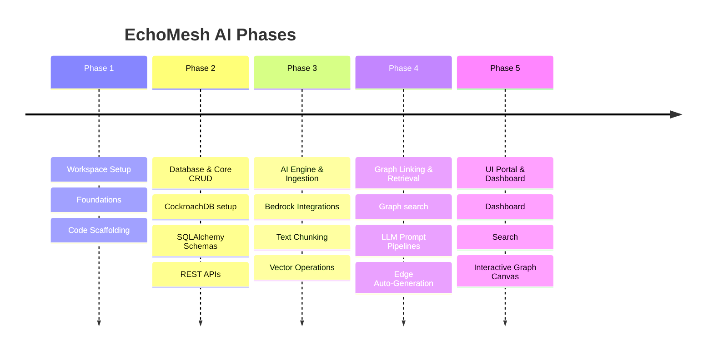

# Project Plan — EchoMesh AI Roadmap

This plan outlines the milestones, timelines, deliverables, and verification procedures for building the EchoMesh AI platform.

---

## 🗺️ High-Level Roadmap

---

## 📍 Milestones Details

### Milestone 1: Workspace Setup & Foundations (Current)
* **Goal**: Establish the mono-repository architecture, dockerized services boundaries, linting configurations, environment bindings, and baseline coding rules.
* **Deliverables**:
  - Validated workspace root files (Docker Compose, Root configurations, Environment bindings, documentation files).
  - Code template scaffolding for FastAPI backend and Next.js frontend.
* **Verification**:
  - Run `docker-compose config` to verify syntax.
  - Assert configuration loads without schema errors.

### Milestone 2: CockroachDB Relational Setup & API Core CRUD
* **Goal**: Spin up local CockroachDB instances, implement schema definitions using SQLModel/SQLAlchemy, configure database migrations (Alembic), and build basic CRUD HTTP endpoints.
* **Deliverables**:
  - Relational database schema with models for `User`, `Team`, `Project`, `Memory`, `MemoryLink`, `Alternative`, and `AuditLog`.
  - Alembic migration files to auto-construct target database state.
  - REST endpoints under FastAPI `api/v1` for authenticating users, managing teams, and performing baseline CRUD on memories.
* **Verification**:
  - Run pytest unit tests verifying DB connections, transactions, and foreign key cascades.

### Milestone 3: S3 uploads, Amazon Bedrock SDKs & Ingestion Service
* **Goal**: Connect backend APIs to AWS cloud infrastructure, implement document chunking structures, and write extraction pipes via Amazon Bedrock (Claude 3.5 & Titan Embeddings).
* **Deliverables**:
  - AWS client utilities (`boto3` setup) targeting S3 storage buckets and Bedrock clients.
  - Text extracting utility supporting markdown logs, raw files, and meeting transcripts.
  - Ingestion pipeline: extracts structured memory objects from text payloads, queries Titan Embeddings for vectors, and saves both into CockroachDB.
* **Verification**:
  - Run pipeline tests asserting ingested Markdown is successfully chunked, vectorized (1536 dimensions), and persisted.

### Milestone 4: Graph Linking Engine & Context Retrieval (RAG)
* **Goal**: Build algorithms to link related memories (graph edges) and implement hybrid vector-graph search models to feed target LLM reasoning pipelines.
* **Deliverables**:
  - Adjacency database traverser utilizing PostgreSQL/CockroachDB recursive CTEs.
  - Automated graph edge generation: checks semantic neighbors of new memories, evaluates relations using Claude, and saves edges (e.g. `supersedes`).
  - Search controller: executes reciprocal rank fusion (RRF) combining keyword queries and vector cosine similarities, expands context via graph relations, and generates reasoning responses using Claude.
* **Verification**:
  - Test query retrieves correct historical reasons and rejection context blocks for architectural questions.

### Milestone 5: Next.js Frontend Dashboard & Force-Directed Graph UI
* **Goal**: Develop a responsive React dashboard allowing developers to explore memories, review architectural decisions, ask natural language questions, and visualize knowledge links.
* **Deliverables**:
  - Clean Dashboard layouts, memories grids, search bars, and reasoning chat overlays.
  - Dynamic force-directed graph canvas (using D3.js or react-force-graph) visualising memories and links.
* **Verification**:
  - Manual verification: clicking on nodes in the UI dynamically expands related decisions, reasons, and rejected alternatives.
