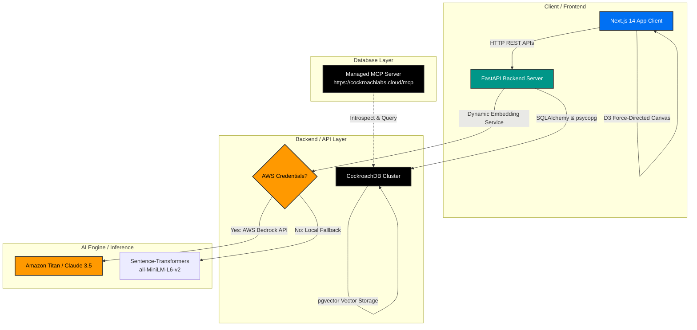

# EchoMesh AI

> **The AI Memory Operating System for Teams**  
> Capture, index, link, and traverse team knowledge across code logs, architecture decisions, tasks, and discussions—resiliently powered by CockroachDB and AWS.

---

## 🗺️ System Architecture

The diagram below details the architecture of EchoMesh AI:



---

## 🛠️ Technology Stack

* **Frontend**: Next.js 14+ (App Router, TypeScript), Tailwind CSS, React Query
* **Backend**: FastAPI (Python 3.11+), SQLModel / SQLAlchemy
* **Database**: CockroachDB (distributed SQL, relational and vector data)
* **AI Layer**: Amazon Bedrock (Claude 3.5 Sonnet & Amazon Titan Text Embeddings)
* **Local Fallback**: PyTorch, Hugging Face `sentence-transformers` (`all-MiniLM-L6-v2`)
* **Infrastructure**: AWS App Runner, ECS, Docker & Docker Compose

---

## 🪳 CockroachDB Tools Used

To deliver scaling database performance and context-aware LLM operations, EchoMesh AI integrates:

### 1. Distributed Vector Search (pgvector)
We store high-dimensional Amazon Bedrock Titan Text Embeddings directly in CockroachDB's `memories` table using standard vector columns. This enables semantic similarity searches over team memories, allowing the platform to dynamically fetch context-relevant architectural paths and historical decisions.

### 2. CockroachDB Managed MCP Server
We provide configuration and client blueprints for connecting to the **CockroachDB Managed MCP Server** (`https://cockroachlabs.cloud/mcp`). This Model Context Protocol endpoint enables autonomous agents and developer IDEs (like Claude Desktop or Cursor) to safely connect to CockroachDB cloud clusters to:
* Discover and inspect relational database schemas dynamically.
* Analyze query performance using execution plans (`EXPLAIN`).
* Run read-only diagnostic/context queries.

#### Setup MCP Configuration
To connect your IDE or agent to the Managed MCP server, add this configuration snippet to your client's `mcp.json` (or `.cursor/mcp.json`):
```json
{
  "mcpServers": {
    "cockroachdb-cloud": {
      "type": "http",
      "url": "https://cockroachlabs.cloud/mcp",
      "headers": {
        "mcp-cluster-id": "<YOUR_CLUSTER_ID>",
        "Authorization": "Bearer <YOUR_SERVICE_ACCOUNT_API_KEY>"
      }
    }
  }
}
```
You can run the helper script `python backend/app/mcp_memory_agent.py` to see a demonstration of how an agent uses this protocol to introspect database state.

---

## ☁️ AWS Services Used

* **Amazon Bedrock**: Used for inference. It executes text embedding generation (`amazon.titan-embed-text-v1/v2`) and prompts Anthropic Claude 3.5 Sonnet for link classification and RAG.
* **AWS App Runner**: Configured via [aws-apprunner.yaml](file:///c:/Users/Lavannya%20Hedaoo/OneDrive/Documents/EchoMesh%20AI/aws-apprunner.yaml) to host the Python FastAPI backend directly from our GitHub repository, enabling auto-scaling web API endpoints.
* **AWS ECS / ECR**: Production container files [docker-compose.aws.yml](file:///c:/Users/Lavannya%20Hedaoo/OneDrive/Documents/EchoMesh%20AI/docker-compose.aws.yml) are set up to deploy containerized frontend and backend tasks to an ECS cluster backed by AWS Fargate.

---

## 📂 Directory Layout

```text
.
├── backend/                  # FastAPI Backend API service
│   ├── app/                  # Main backend codebase
│   │   ├── api/              # API router endpoints
│   │   ├── core/             # DB setups, configs, logging, security
│   │   ├── models/           # SQLAlchemy DB schema entities
│   │   ├── schemas/          # Pydantic data schemas
│   │   ├── services/         # Business logic (AI pipelines, graphs)
│   │   └── main.py           # API Entry Point
│   ├── Dockerfile            # Production Backend Dockerfile
│   └── requirements.txt      # Backend Python dependencies
├── frontend/                 # Next.js Frontend SPA UI
│   ├── src/                  # Next.js App components
│   ├── Dockerfile            # Development Frontend Dockerfile
│   ├── Dockerfile.frontend   # Production Frontend Dockerfile
│   └── package.json          # Node dependencies
├── docker-compose.yml        # Local developer orchestration (DB, API, SPA)
├── docker-compose.aws.yml    # Production container orchestration
├── aws-apprunner.yaml        # AWS App Runner deployment settings
├── mcp_config.json           # Model Context Protocol Managed Server config
└── .env.example              # Environments template
```

---

## 🚀 Setup & Run Instructions

### 1. Local Development (Docker Compose)
1. **Duplicate environments template**:
   ```bash
   cp .env.example .env
   ```
2. **Start services**:
   ```bash
   docker-compose up --build
   ```
   This spins up:
   * **CockroachDB**: Database endpoint at `localhost:26257` and Admin Panel at `localhost:8080`.
   * **FastAPI Backend**: API routes running at `localhost:8000` (runs with dev hot-reloading).
   * **Next.js Frontend**: Portal UI running at `localhost:3000`.

### 2. Manual Local Setup (Virtual Environment)
To run the backend locally on your host machine:
```bash
# Create and activate virtual environment
python -m venv venv
.\venv\Scripts\activate  # Windows
source venv/bin/activate  # macOS/Linux

# Install dependencies
pip install -r backend/requirements.txt

# Run the backend
python -m uvicorn backend.app.main:app --host 0.0.0.0 --port 8000 --reload
```

### 3. Production Cloud Deployment
* **AWS App Runner (FastAPI)**: Deploy via the AWS Console/CLI by linking your GitHub repository and choosing the `aws-apprunner.yaml` configuration.
* **AWS ECS / ECR**:
  1. Build the production images:
     ```bash
     docker build -f backend/Dockerfile -t echomesh-backend ./backend
     docker build -f frontend/Dockerfile.frontend -t echomesh-frontend ./frontend
     ```
  2. Push the built images to your AWS ECR registries.
  3. Deploy the task definitions defined in `docker-compose.aws.yml` using AWS Copilot or ECS CLI.
